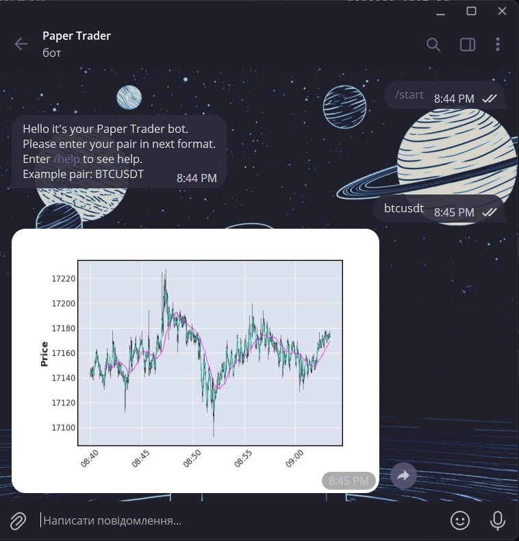

# Paper Trader telegram bot
#####By Adrian Kuzhel

# Create the same bot with GitHub

### Clone repository
```shell 
git clone https://github.com/fsocie7y/paper-trader-bot.git
```
### Open directory in IDE
### Create virtual environment
```shell 
python -m venv venv
```
### Activate venv
#### Windows
```shell 
venv\Scripts\activate
```
#### MacOS/Linux
```shell 
source venv/bin/activate
```
### Install requirements
```shell 
pip install -r requirements.txt
```
### Set up your bot API key in environment variable
```shell 
export BOT_KEY = 'ENTER YOUR API'
```
### Start bot
```shell 
python echo_bot.py
```

## Example functionality
